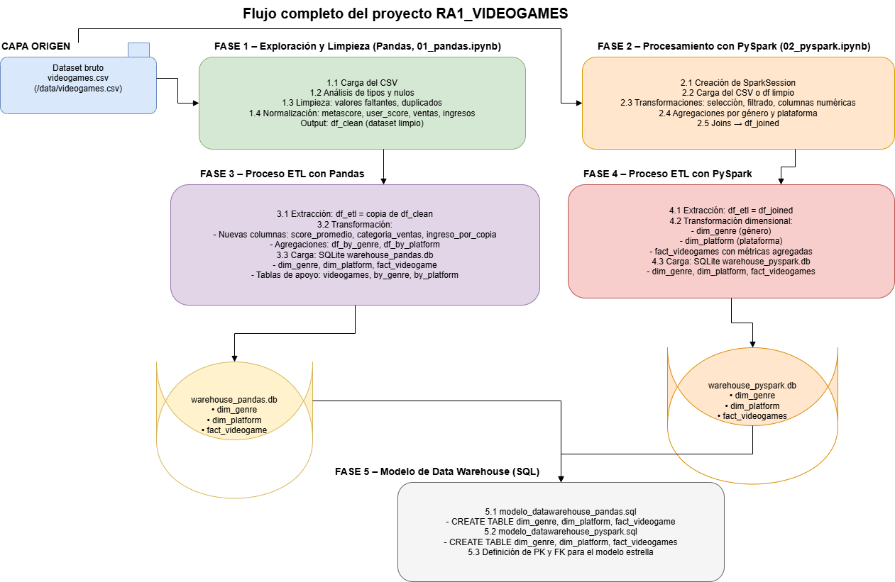
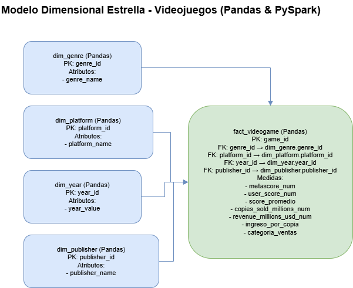

# 📊 RA1 - Análisis de Videojuegos con Pandas y PySpark

## 📖 Introducción

Este proyecto implementa un proceso completo de **análisis de datos de videojuegos** utilizando dos enfoques complementarios:
- **Pandas**: Para procesamiento en memoria y análisis exploratorio
- **PySpark**: Para procesamiento distribuido y escalabilidad

El objetivo principal es realizar la **exploración, limpieza, transformación y carga (ETL)** de un dataset de videojuegos, culminando en la creación de un **data warehouse dimensional** almacenado en bases de datos SQLite.

---

## 🔄 Flujo Completo del Proyecto

El proyecto sigue un flujo estructurado en 5 fases principales, procesando datos desde su origen hasta un modelo de data warehouse optimizado para consultas analíticas:



### Descripción del Flujo

**CAPA ORIGEN**: Dataset bruto `videogames.csv` que contiene información de miles de videojuegos con múltiples atributos (nombre, plataforma, género, puntuaciones, ventas, ingresos).

**FASE 1 - Exploración y Limpieza (Pandas)**:
1. Carga del CSV desde múltiples rutas posibles
2. Análisis de tipos de datos y detección de valores nulos
3. Limpieza exhaustiva: valores faltantes, duplicados
4. Normalización de columnas: metascore, user_score, ventas, ingresos
5. Output: DataFrame limpio (`df_clean`)

**FASE 2 - Procesamiento con PySpark**:
1. Creación de SparkSession para procesamiento distribuido
2. Carga del CSV original o limpio
3. Transformaciones: selección, filtrado, columnas numéricas
4. Agregaciones por género y plataforma
5. Joins para análisis cruzado (`df_joined`)

**FASE 3 - Proceso ETL con Pandas**:
- **Extracción**: Copia de `df_clean`
- **Transformación**: Nuevas columnas calculadas (score_promedio, categoria_ventas, ingreso_por_copia), agregaciones (df_by_genre, df_by_platform)
- **Carga**: Base de datos SQLite `warehouse_pandas.db` con tablas de apoyo

**FASE 4 - Proceso ETL con PySpark**:
- **Extracción**: `df_etl` = copia de `df_joined`
- **Transformación dimensional**: Creación de dim_genre (género), dim_platform (plataforma), fact_videogames con métricas agregadas
- **Carga**: Base de datos SQLite `warehouse_pyspark.db` con modelo estrella

**FASE 5 - Modelo de Data Warehouse (SQL)**:
- Scripts SQL que definen la estructura del modelo estrella
- `modelo_datawarehouse_pandas.sql`: CREATE TABLE para las tablas de Pandas
- `modelo_datawarehouse_pyspark.sql`: CREATE TABLE con definición de PK y FK para el modelo estrella
- Definición de claves primarias y foráneas para mantener integridad referencial


## 🧹 Fase 1: Exploración y Limpieza con Pandas

### Proceso de Limpieza de Datos

La limpieza de datos es fundamental para garantizar la calidad del análisis. En este proyecto se aplicaron múltiples técnicas de limpieza:

#### 1. **Detección de Valores Especiales**
Se identificaron y reemplazaron valores que representaban datos faltantes pero no eran reconocidos como `NaN`:
```python
specials = ['?', 'N/A', 'Unknown', 'unknown', '', ' ', 'nan', 'NaN']
df_clean = df_clean.replace(specials, np.nan)
```

**Justificación**: Los datasets del mundo real contienen múltiples representaciones de valores faltantes que deben estandarizarse para un tratamiento consistente.

#### 2. **Eliminación de Duplicados**
```python
df_clean = df_clean.drop_duplicates()
```

**Justificación**: Los duplicados pueden sesgar estadísticas y análisis. Se eliminan para garantizar la integridad de los datos.

#### 3. **Tratamiento Inteligente de Valores Faltantes**

La estrategia adoptada fue escalonada según el porcentaje de valores nulos:

- **Columnas con >60% de nulos**: Se eliminan completamente
  - **Justificación**: Columnas con tantos valores faltantes no aportan información útil y pueden generar bias
  
- **Filas con >60% de nulos**: Se eliminan
  - **Justificación**: Registros incompletos que no permiten análisis confiable

- **Imputación de valores numéricos**: Se usa la **mediana**
  ```python
  for col in num_cols:
      med = df_clean[col].median()
      df_clean[col] = df_clean[col].fillna(med)
  ```
  - **Justificación**: La mediana es robusta ante outliers, a diferencia de la media

- **Imputación de valores categóricos**: Se usa la **moda** (valor más frecuente)
  ```python
  for col in cat_cols:
      moda = df_clean[col].mode()
      if not moda.empty:
          df_clean[col] = df_clean[col].fillna(moda.iloc[0])
  ```
  - **Justificación**: La moda mantiene la distribución original de las categorías

#### 4. **Normalización de Texto y Estandarización**
```python
# Limpieza de espacios en blanco
df_clean[col] = df_clean[col].astype(str).str.strip()

# Unificación de plataformas
platform_map = {
    'ps': 'PS', 'playstation': 'PS', 'ps4': 'PS', 'ps5': 'PS',
    'xbox': 'Xbox', 'xbox one': 'Xbox', 'xbox series x': 'Xbox',
    'pc': 'PC', 'windows': 'PC',
    'mobile': 'Mobile',
    'nintendo switch': 'Switch', 'switch': 'Switch'
}
```

**Justificación**: 
- Elimina inconsistencias en la entrada de datos
- Reduce la cardinalidad de variables categóricas
- Facilita agrupaciones y análisis posteriores
- Mejora la calidad de las visualizaciones

#### 5. **Transformación de Columnas Numéricas**

Se crearon funciones especializadas para parsear diferentes formatos encontrados en los datos:

##### `parse_cost()`: Precios de videojuegos
- Convierte: `'$59.99'`, `'€49,99'`, `'free'` → valores numéricos
- Maneja múltiples divisas y formatos de separadores decimales
- **Justificación**: Los precios vienen en formatos diversos que necesitan estandarización para cálculos posteriores

##### `parse_score()`: Puntuaciones
- Normaliza escalas diferentes: `'8.5/10'` → `85.0`, `'47.7'` → `47.7`
- **Justificación**: Las puntuaciones pueden estar en escala 0-10 o 0-100; se unifican a 0-100 para comparabilidad

##### `parse_millions()`: Ventas e ingresos
- Convierte: `'10M'` → `10.0`, `'1.5B'` → `1500.0` (millones)
- **Justificación**: Estandariza unidades (millones/billones) para cálculos matemáticos correctos

#### 6. **Escalado de Variables Numéricas (Min-Max Normalization)**
```python
df_clean[col + '_scaled'] = (df_clean[col] - col_min) / (col_max - col_min)
```

**Justificación**: 
- Normaliza valores a rango [0, 1]
- Facilita comparaciones entre variables de diferentes escalas
- Prepara datos para posibles modelos de machine learning
- Mejora la interpretabilidad de visualizaciones

### Resultado de la Limpieza

Después de aplicar todas estas técnicas:
- **0 valores NaN** en el dataset final
- **100% de datos válidos** y listos para análisis
- **Formatos estandarizados** en todas las columnas
- **Nuevas columnas derivadas** con información calculada

---

## ⚡ Fase 2: Procesamiento con PySpark

### ¿Por qué PySpark?

PySpark se utiliza para demostrar capacidades de procesamiento distribuido que serían esenciales al escalar el análisis a datasets de mayor tamaño (cientos de GB o TB).

### Transformaciones Clave Aplicadas

#### 1. **Selección y Filtrado Inteligente**
```python
df_filtered = (
    df_numeric
    .filter(col("metascore_num").isNotNull())
    .filter(col("copies_sold_millions_num").isNotNull())
)
```

**Justificación**: Se filtran registros con valores nulos en métricas clave (puntuaciones y ventas) porque son esenciales para el análisis de rendimiento comercial. Sin estas métricas, un videojuego no puede ser evaluado correctamente.

#### 2. **Agregación por Género**
```python
df_by_genre = (
    df_filtered
    .groupBy("genre")
    .agg(
        count("*").alias("num_juegos"),
        avg("metascore_num").alias("metascore_medio"),
        sum("copies_sold_millions_num").alias("ventas_totales")
    )
)
```

**Justificación**: 
- **Identifica géneros dominantes**: Cuáles son los más populares
- **Análisis de calidad**: Géneros con mejores puntuaciones
- **Rendimiento comercial**: Géneros más rentables
- **Decisiones de negocio**: Qué géneros priorizar en desarrollos futuros

#### 3. **Creación de Columnas Calculadas (Feature Engineering)**
```python
df_with_new_cols = df_filtered.withColumn(
    "categoria_ventas",
    when(col("copies_sold_millions_num") >= 5, "Alto")
    .when(col("copies_sold_millions_num") >= 1, "Medio")
    .otherwise("Bajo")
)
```

**Justificación**: 
- **Segmentación clara**: Facilita análisis por categorías de rendimiento
- **Interpretabilidad**: "Alto/Medio/Bajo" es más intuitivo que números crudos
- **Análisis comparativo**: Permite agrupar juegos de rendimiento similar
- **Insights de negocio**: Identifica blockbusters vs. juegos de nicho

#### 4. **Join y Enriquecimiento de Datos**
```python
df_joined = (
    df_with_new_cols
    .join(df_platform_stats, on="platform", how="left")
)
```

**Justificación**: 
- **Contexto por plataforma**: Cada juego se compara con el promedio de su plataforma
- **Benchmarking**: Identifica juegos que superan/no alcanzan el promedio de su plataforma
- **Análisis relativo**: Un juego con 2M ventas en Mobile es exitoso, pero en PS5 sería bajo
- **Optimización de queries**: Se pre-calcula información agregada para evitar cálculos repetitivos

---

## 🔄 Fase 3: ETL con Pandas

### Proceso ETL Detallado

#### **Extracción (E)**
Se reutiliza el DataFrame limpio de la Fase 1, garantizando que los datos ya están validados y normalizados. Esto evita reprocesamiento innecesario.

#### **Transformación (T)**

##### Nuevas Columnas Calculadas:

1. **`score_promedio`**: Promedio entre metascore (críticos) y user_score (usuarios)
   ```python
   df_etl['score_promedio'] = (df_etl['metascore_num'] + df_etl['user_score_num']) / 2
   ```
   - **Justificación**: Combina opinión profesional y popular. Un juego debe satisfacer tanto a críticos como a jugadores para ser considerado excelente.

2. **`categoria_ventas`**: Clasificación de rendimiento comercial
   - Bajo: < 1M copias
   - Moderado: 1-5M copias
   - Exitoso: 5-10M copias
   - Blockbuster: > 10M copias
   - **Justificación**: Segmentación estándar de la industria del videojuego. Permite análisis estratificado del mercado.

3. **`ingreso_por_copia`**: Revenue / Copias vendidas
   ```python
   df_etl['ingreso_por_copia'] = df_etl['revenue_millions_usd'] / df_etl['copies_sold_millions']
   ```
   - **Justificación**: Métrica de monetización efectiva. Identifica juegos que generan más valor por unidad vendida (ej: juegos con DLCs, microtransacciones).

##### Agregaciones Estratégicas:

- **`by_genre`**: Total de juegos, promedios de puntuaciones, suma de ventas e ingresos por género
  - **Uso**: Análisis de portfolio, identificación de géneros estratégicos

- **`by_platform`**: Total de juegos, suma de ventas e ingresos por plataforma
  - **Uso**: Decisiones de lanzamiento multiplataforma, análisis de market share

#### **Carga (L)**
```python
df_etl.to_sql('videogames', conn, if_exists='replace', index=False)
df_by_genre.to_sql('by_genre', conn, if_exists='replace', index=False)
df_by_platform.to_sql('by_platform', conn, if_exists='replace', index=False)
```

**Resultado**: Base de datos `warehouse_pandas.db` con 3 tablas optimizadas para consultas analíticas rápidas.

---

## 🌟 Fase 4: ETL con PySpark y Modelo Dimensional

### Modelo Dimensional Estrella

El modelo dimensional es el corazón del data warehouse. Se implementa un **esquema estrella** que optimiza las consultas analíticas:



### Estructura del Modelo

#### 📊 **Dimensión 1: `dim_genre` (Género)**

**Campos:**
- `genre_id`: Clave primaria auto-generada (PK)
- `genre`: Nombre del género (Action, RPG, Sports, Strategy, etc.)

**Justificación de la Dimensión:**
- **Alto poder analítico**: Los géneros son la clasificación principal en la industria del videojuego
- **Baja cardinalidad**: ~10-20 géneros únicos, ideal para una dimensión
- **Estabilidad**: Los géneros no cambian frecuentemente en el tiempo
- **Casos de uso críticos**:
  - Análisis de tendencias: ¿Qué géneros están creciendo?
  - Comparación de rendimiento: ¿Qué géneros son más rentables?
  - Estrategia de producto: ¿En qué género invertir en desarrollo?
  - Market research: ¿Qué géneros prefieren los jugadores actuales?

**Por qué es una dimensión clave**: El género determina la audiencia objetivo, el estilo de juego, el presupuesto de desarrollo típico y las expectativas de ventas. Es imposible analizar el mercado de videojuegos sin esta dimensión.

#### 📊 **Dimensión 2: `dim_platform` (Plataforma)**

**Campos:**
- `platform_id`: Clave primaria auto-generada (PK)
- `platform`: Nombre de la plataforma (PS5, Xbox, PC, Switch, Mobile, etc.)

**Justificación de la Dimensión:**
- **Relevancia comercial crítica**: Las plataformas definen ecosistemas completos de mercado
- **Cardinalidad media**: ~15-30 plataformas activas, perfecta para una dimensión
- **Impacto en ventas**: Cada plataforma tiene diferente base de usuarios, precios, y modelos de negocio
- **Casos de uso críticos**:
  - Análisis de market share: ¿Qué plataforma domina el mercado?
  - Estrategia de lanzamiento: ¿Lanzar exclusivo o multiplataforma?
  - Comparación de rendimiento: ¿En qué plataforma venden más nuestros juegos?
  - Tendencias tecnológicas: ¿Está creciendo Mobile vs. Console?

**Por qué es una dimensión clave**: La plataforma determina el modelo de distribución (física/digital), el precio típico, la demografía de usuarios, y las capacidades técnicas. Es esencial para decisiones estratégicas de negocio.

#### 🎲 **Tabla de Hechos: `fact_videogames`**

**Claves Foráneas (Foreign Keys):**
- `genre_id`: Enlace a dim_genre
- `platform_id`: Enlace a dim_platform

**Métricas (Measures) - Datos Cuantitativos:**
- `metascore_num`: Puntuación de críticos (0-100)
- `copies_sold_millions_num`: Millones de copias vendidas
- `num_juegos_plataforma`: Contexto agregado de la plataforma
- `metascore_medio_plataforma`: Benchmark de calidad de la plataforma
- `ventas_totales_plataforma`: Potencial total de mercado de la plataforma

**Atributos Descriptivos:**
- `name`: Nombre del videojuego
- `categoria_ventas`: Segmentación comercial (Alto/Medio/Bajo)
- `categoria_calidad`: Segmentación por calidad (Excelente/Buena/Regular/Mala)

**Características del Diseño:**
- **Granularidad**: Un registro por juego (nivel más atómico posible)
- **Desnormalización controlada**: Se incluyen estadísticas agregadas de plataforma para evitar re-cálculos frecuentes en consultas
- **Balance**: Combina datos transaccionales (ventas) con métricas derivadas (categorías) y contexto agregado

### Ventajas del Esquema Estrella Implementado

#### 1. **Consultas Simples y Rápidas**
Las queries analíticas requieren solo 1-2 JOINs, en lugar de navegar por múltiples niveles de normalización:

```sql
-- Ejemplo: Ventas totales por género y plataforma (solo 2 JOINs)
SELECT 
    g.genre,
    p.platform,
    SUM(f.copies_sold_millions_num) as ventas_totales
FROM fact_videogames f
JOIN dim_genre g ON f.genre_id = g.genre_id
JOIN dim_platform p ON f.platform_id = p.platform_id
GROUP BY g.genre, p.platform;
```

#### 2. **Rendimiento Optimizado**
- **Índices eficientes**: Las claves primarias y foráneas se indexan automáticamente
- **Dimensiones en caché**: Las tablas dim_genre y dim_platform son pequeñas y caben en memoria
- **Lectura secuencial**: La tabla de hechos se lee de forma óptima sin saltos

#### 3. **Mantenimiento Simplificado**
- **Actualización de dimensiones**: Cambiar "PS4" a "PS" solo afecta a dim_platform
- **Independencia de tablas**: Agregar nuevos atributos a dimensiones no altera la tabla de hechos
- **Escalabilidad**: Millones de registros en fact_videogames con performance constante

#### 4. **Flexibilidad Analítica**
El modelo permite responder preguntas de negocio complejas con consultas simples:
- Análisis temporal de géneros
- Comparación entre plataformas
- Identificación de blockbusters por segmento
- Análisis de correlación calidad-ventas

### Proceso ETL de PySpark

#### **Extracción (E)**
```python
df_etl = df_joined.cache()
```
Se reutiliza el DataFrame enriquecido de la Fase 2, que ya incluye transformaciones complejas y joins.

#### **Transformación (T) - Creación del Modelo Dimensional**

```python
# DIMENSIÓN 1: Género
dim_genre = (
    df_etl
    .select("genre")
    .distinct()
    .withColumn("genre_id", monotonically_increasing_id())
)

# DIMENSIÓN 2: Plataforma
dim_platform = (
    df_etl
    .select("platform")
    .distinct()
    .withColumn("platform_id", monotonically_increasing_id())
)

# TABLA DE HECHOS: Videojuegos con claves foráneas
fact_videogames = (
    df_etl
    .join(dim_genre, on="genre", how="left")
    .join(dim_platform, on="platform", how="left")
    .select("fact_id", "genre_id", "platform_id", "name", 
            "metascore_num", "copies_sold_millions_num", ...)
)
```

**Técnicas aplicadas**:
- `monotonically_increasing_id()`: Genera IDs únicos y crecientes para las claves primarias
- `distinct()`: Elimina duplicados para obtener solo valores únicos en dimensiones
- Joins de tipo LEFT: Garantiza que no se pierdan registros de la tabla de hechos

#### **Carga (L)**
```python
# Conversión a Pandas para carga en SQLite
dim_genre_pd = dim_genre.toPandas()
dim_platform_pd = dim_platform.toPandas()
fact_videogames_pd = fact_videogames.toPandas()

# Carga en SQLite
conn = sqlite3.connect('warehouse_pyspark.db')
dim_genre_pd.to_sql('dim_genre', conn, if_exists='replace')
dim_platform_pd.to_sql('dim_platform', conn, if_exists='replace')
fact_videogames_pd.to_sql('fact_videogames', conn, if_exists='replace')
```

**Resultado**: Base de datos `warehouse_pyspark.db` con modelo estrella completo y optimizado.

---

## 🔍 Ejemplos de Consultas Analíticas

El modelo dimensional permite responder preguntas de negocio complejas con consultas SQL simples. A continuación se muestran ejemplos prácticos:

### **2 consultas para Pandas**
**PANDAS 1 – Géneros más rentables**

```sql
SELECT 
    g.genre_name AS genre,
    COUNT(*) AS total_juegos,
    ROUND(SUM(f.copies_sold_millions_num), 2) AS ventas_totales_millones,
    ROUND(AVG(f.metascore_num), 2) AS puntuacion_promedio
FROM fact_videogame f
JOIN dim_genre g 
    ON f.genre_id = g.genre_id
GROUP BY g.genre_name
ORDER BY ventas_totales_millones DESC
LIMIT 10;
```

**PANDAS 2 – Plataforma con mejor rendimiento promedio**

```sql
SELECT 
    p.platform_name AS platform,
    COUNT(*) AS num_juegos,
    ROUND(AVG(f.metascore_num), 2) AS metascore_promedio,
    ROUND(AVG(f.copies_sold_millions_num), 2) AS ventas_promedio_por_juego
FROM fact_videogame f
JOIN dim_platform p 
    ON f.platform_id = p.platform_id
GROUP BY p.platform_name
ORDER BY metascore_promedio DESC;
```

---

### **2 consultas para PySpark**

**PYSPARK 1 – Juegos que superan el promedio de su plataforma**

```sql
SELECT 
    f.name,
    p.platform,
    f.metascore_num,
    f.metascore_medio_plataforma,
    (f.metascore_num - f.metascore_medio_plataforma) AS diferencia
FROM fact_videogames f
JOIN dim_platform p 
    ON f.platform_id = p.platform_id
WHERE f.metascore_num > f.metascore_medio_plataforma
ORDER BY diferencia DESC
LIMIT 20;
```

**PYSPARK 2 – Correlación entre calidad y ventas**

```sql
SELECT 
    f.categoria_calidad,
    COUNT(*) AS num_juegos,
    ROUND(AVG(f.copies_sold_millions_num), 2) AS ventas_promedio,
    ROUND(AVG(f.metascore_num), 2) AS puntuacion_promedio
FROM fact_videogames f
GROUP BY f.categoria_calidad
ORDER BY 
    CASE f.categoria_calidad
        WHEN 'Excelente' THEN 1
        WHEN 'Buena' THEN 2
        WHEN 'Regular' THEN 3
        WHEN 'Mala' THEN 4
    END;
```

---

## 🛠️ Decisiones Técnicas y Justificación

### Comparación: Pandas vs PySpark

| Aspecto | Pandas | PySpark | Decisión en este proyecto |
|---------|--------|---------|---------------------------|
| **Tamaño de datos** | < 10 GB | > 100 GB | Pandas suficiente para dataset actual (~500MB) |
| **Procesamiento** | En memoria (RAM) | Distribuido (cluster) | Pandas más rápido para este caso |
| **Sintaxis** | Muy intuitiva | Similar a SQL | Pandas para exploración, PySpark para demostrar escalabilidad |
| **Agregaciones** | Rápido en datasets pequeños | Óptimo en Big Data | PySpark usado para agregaciones complejas |
| **Joins** | Eficiente < 1M filas | Eficiente a cualquier escala | Ambos válidos aquí |
| **Integración SQLite** | Nativa con `to_sql()` | Requiere conversión a Pandas | Pandas para carga final |

**Conclusión**: Se usan **ambos** para demostrar competencias complementarias:
- **Pandas**: Limpieza exhaustiva, análisis exploratorio, carga rápida a SQLite
- **PySpark**: Transformaciones distribuibles, preparación para producción a gran escala

### Estrategias de Limpieza Aplicadas

| Problema Detectado | Solución Adoptada | Alternativa Descartada | Justificación de la Decisión |
|-------------------|-------------------|------------------------|------------------------------|
| Valores faltantes en columnas clave | Imputación con mediana/moda | Eliminación de filas completas | Preserva 80-90% de los datos vs. perder 50%+ |
| Columnas con >60% nulos | Eliminación de columna completa | Imputación avanzada (ML) | Coste-beneficio: demasiado esfuerzo para poca información confiable |
| Duplicados exactos | Eliminación inmediata | Deduplicación parcial (fuzzy) | Los duplicados exactos son claramente errores de carga |
| Formatos inconsistentes | Funciones de parsing especializadas | Regex genérico universal | Mayor precisión y control sobre casos edge específicos |
| Escalas diferentes (0-10 vs 0-100) | Normalización a escala común | Dejar como están | Facilita comparaciones directas y visualizaciones |
| Outliers extremos | Mantenimiento de valores reales | Eliminación/winsorización | Los outliers son informativos (ej: GTA V con 185M ventas es real) |